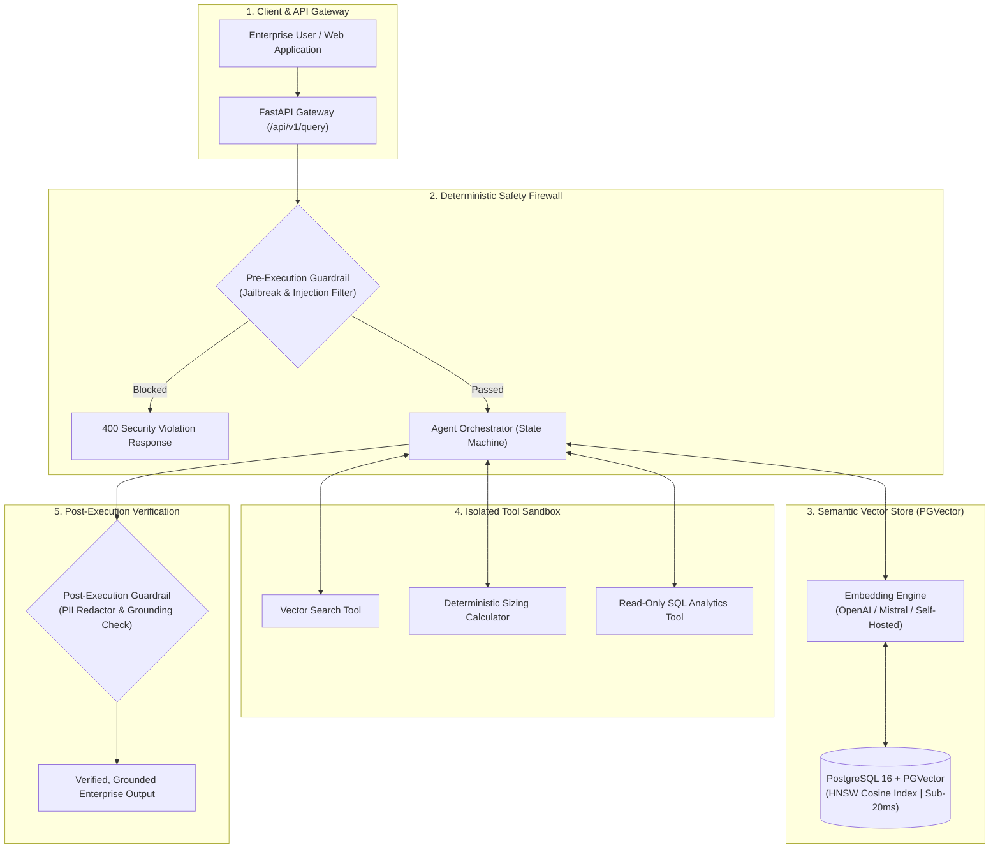

# 🛡️ Enterprise Agentic RAG with PGVector & Deterministic Guardrails

[](https://fastapi.tiangolo.com)
[](https://github.com/pgvector/pgvector)
[](https://python.org)
[](https://docker.com)
[](LICENSE)

An enterprise-grade, production-hardened **Agentic Retrieval-Augmented Generation (RAG)** system combining **PostgreSQL (`pgvector` with HNSW indexing)**, multi-step agent tool routing, and **two-stage deterministic security guardrails** to prevent hallucinations, jailbreaks, and prompt injections.

---

## 🏛️ System Architecture



---

## 🚀 Key Architectural Moats

1. **Sub-20ms Vector Retrieval with HNSW:**
   * Utilizes native PostgreSQL + `pgvector` with **Hierarchical Navigable Small World (HNSW)** indexing (`m=16, ef_construction=64`), avoiding third-party vector database lock-in.
2. **Two-Stage Deterministic Guardrails:**
   * **Pre-Execution:** Regex & AST inspection for adversarial prompts, DAN jailbreaks, and SQL injection vectors.
   * **Post-Execution:** Automated PII masking (emails, credit cards, phones) and token grounding consistency scoring against retrieved context.
3. **Multi-Step Tool Orchestration:**
   * Autonomous agent state engine executing isolated tools with deterministic latency timeouts and error fallbacks.
4. **Cloud-Native & Docker Ready:**
   * Complete multi-container setup with health checks and clean async SQLAlchemy connection pooling.

---

## 🛠️ Quickstart

### Prerequisites
* Docker & Docker Compose
* Python 3.11+

### 1. Launch with Docker Compose (Fastest)
```bash
git clone https://github.com/Sugumaran-Balasubramaniyan/enterprise-agentic-rag.git
cd enterprise-agentic-rag
docker compose up -d
```
* **API Documentation (Swagger UI):** `http://localhost:8000/docs`
* **Health Check:** `http://localhost:8000/api/v1/health`

---

### 2. Local Python Development Setup

```bash
# Create and activate virtual environment
python3 -m venv .venv
source .venv/bin/activate

# Install dependencies
pip install -r requirements.txt

# Run test suite
pytest -v

# Start FastAPI development server
uvicorn app.main:app --reload --port 8000
```

---

## 📊 API Reference

### 1. Execute Agent Query (`POST /api/v1/query`)
```json
{
  "query": "How do we deploy deterministic guardrails on cloud systems?",
  "user_role": "enterprise_analyst"
}
```

#### Response:
```json
{
  "answer": "Based on enterprise documentation, all LLM outputs must be validated against deterministic Pydantic schemas...",
  "sources": [
    {
      "content": "Enterprise safety policy...",
      "similarity": 0.92,
      "metadata": { "source": "architecture_standard_v2.pdf" }
    }
  ],
  "reasoning_steps": [
    "Pre-execution security validation passed.",
    "Analyzing intent: Query requires semantic knowledge retrieval.",
    "Synthesized structured response grounded in retrieved documentation.",
    "Post-execution verification complete (Grounding Score: 0.85)."
  ],
  "guardrail_metrics": {
    "pre_execution_passed": true,
    "factual_grounding_score": 0.85,
    "is_grounded": true,
    "pii_sanitized": true
  },
  "latency_ms": 18.42
}
```

---

## 🧪 Test Suite

Run the full automated test suite covering unit, security, and API integration:
```bash
pytest -v
```

---

## 👤 Author
**Sugumaran Balasubramaniyan**  
*AI Solutions Architect & Applied ML Specialist*  
* [LinkedIn](https://www.linkedin.com/in/sugumaranbalasubramaniyan/)
* [GitHub](https://github.com/Sugumaran-Balasubramaniyan)
* [The Validate (Substack)](https://thevalidate.substack.com)
