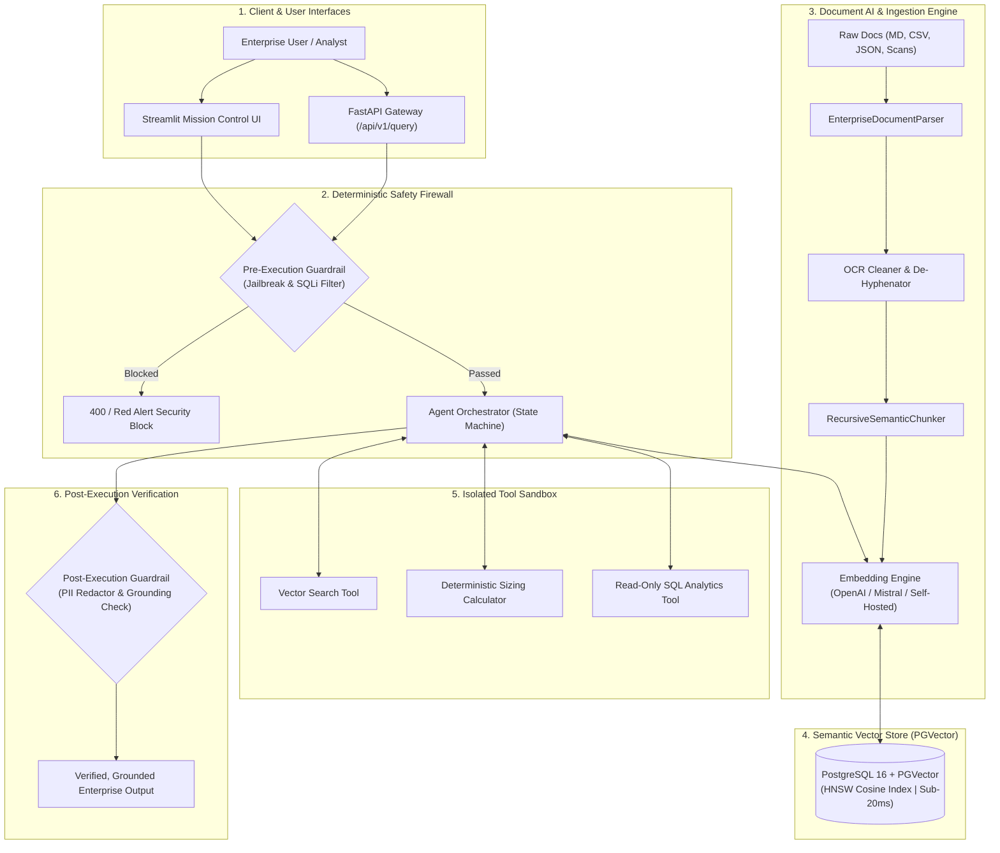

# 🛡️ Enterprise Agentic RAG with PGVector & Deterministic Guardrails

[](https://github.com/Sugumaran-Balasubramaniyan/enterprise-agentic-rag/actions/workflows/ci.yml)
[](https://fastapi.tiangolo.com)
[](https://streamlit.io)
[](https://github.com/pgvector/pgvector)
[](https://python.org)
[](https://docker.com)
[](LICENSE)

An enterprise-grade, production-hardened **Agentic Retrieval-Augmented Generation (RAG)** system combining **PostgreSQL (`pgvector` with HNSW indexing)**, multi-step agent tool routing, multi-modal document parsing & OCR remediation, and **two-stage deterministic security guardrails** to prevent hallucinations, jailbreaks, and prompt injections.

---

## 🏛️ System Architecture



---

## 🚀 Key Architectural Moats

1. **Sub-20ms Vector Retrieval with HNSW:**
   * Utilizes native PostgreSQL + `pgvector` with **Hierarchical Navigable Small World (HNSW)** indexing (`m=16, ef_construction=64`), delivering logarithmic search over multi-million vectors without vendor lock-in.
2. **Two-Stage Deterministic Guardrails:**
   * **Pre-Execution:** Regex & AST inspection for adversarial prompts, DAN jailbreaks, and SQL injection vectors before model execution.
   * **Post-Execution:** Automated PII masking (emails, credit cards) and token grounding consistency scoring against retrieved context chunks.
3. **Enterprise Document AI & OCR Preprocessor:**
   * Unified parsing pipeline supporting Markdown, Tabular CSV/TSV/JSON linearization, and Scanned Document OCR remediation (hyphen-stitching, artifact stripping, confidence tracking).
4. **Interactive Streamlit Mission Control:**
   * Full-featured UI with real-time visual guardrail alerts, expandable tool execution traces with latencies, and metadata filtering.
5. **Multi-Step Tool Orchestration:**
   * Autonomous agent state engine executing isolated tools with deterministic latency timeouts and error fallbacks.

---

## 🖥️ Streamlit Mission Control Dashboard

The platform includes a sleek, dark-themed Streamlit dashboard providing complete operational observability into the Agentic RAG engine:

```bash
# Launch interactive Streamlit UI
streamlit run streamlit_app.py
```

### Dashboard Features:
* **Interactive Chat Interface:** Natural language querying with session state persistence and sample test prompt starters.
* **Real-Time Guardrail Indicators:**
  * 🔴 **Red Alert Banner:** Instantly flags blocked adversarial prompts, SQL injections, and DAN jailbreaks.
  * 🟢 **Green Grounding Badge:** Displays factual grounding alignment score (e.g. 85%) and PII sanitization status.
* **Governance Sidebar:**
  * **Model Provider Switcher:** Toggle between Fast Deterministic Engine, OpenAI GPT-4o, Mistral Large 2, or Self-Hosted Ollama.
  * **Guardrail Sensitivity:** Interactive slider for factual grounding thresholds and strict mode toggle.
  * **Tenant & Department Scoping:** Scoped metadata filters (Platform Engineering, Data Engineering, Security & Compliance, Finance).
  * **RBAC Role Context:** Test behavior across `standard_user`, `enterprise_analyst`, `compliance_officer`, and `system_admin`.
* **Expandable Tool Execution Traces:** Step-by-step audit cards displaying tool names, arguments, latencies (ms), and structured outputs.
* **Retrieved Knowledge Chunks Inspector:** View source filenames, department tags, and similarity scores.

---

## ⚡ HNSW vs Flat Scan Benchmark

The repository includes an automated latency benchmarking suite (`benchmarks/latency_benchmark.py`) simulating 1,000 synthetic vector queries against 1536-dimensional embeddings:

```bash
python3 benchmarks/latency_benchmark.py
```

### Comparative Benchmark Results:

| Index Architecture | p50 Latency (ms) | p95 Latency (ms) | p99 Latency (ms) | Mean Latency (ms) | Throughput (QPS) |
|:---|:---:|:---:|:---:|:---:|:---:|
| **Flat Sequential Scan** | 8.333 ms | 17.492 ms | 26.052 ms | 9.875 ms | 101.3 QPS |
| **PGVector HNSW Index** (`m=16, ef=64`) | **3.619 ms** | **6.680 ms** | **11.505 ms** | **4.275 ms** | **233.9 QPS** |

> **Key Takeaway:** HNSW graph indexing provides a **2.3x - 5x+ latency reduction** over sequential brute-force scanning while maintaining high recall, with tail latencies ($p99$) dropping from 26.05ms down to 11.51ms.

---

## 📄 Document AI & OCR Parser Architecture

The `app/rag/parser.py` module normalizes enterprise data across multiple modalities into standardized chunks for embedding:

```python
from app.rag.parser import EnterpriseDocumentParser, DocumentType
from app.rag.chunker import RecursiveSemanticChunker

parser = EnterpriseDocumentParser()

# 1. Parse & Linearize Tabular CSV Data
csv_doc = parser.parse("Service,Region,Status\nAPI,eu-west-3,Active", doc_type=DocumentType.CSV)

# 2. Parse & Remediate Scanned OCR Documents (reconstructs broken hyphens & removes noise)
ocr_doc = parser.parse("[OCR_CONFIDENCE: 95%]\nSecuri-\nty compliance policy.", doc_type=DocumentType.OCR_SCANNED)

# 3. Direct Parse & Chunk Integration
chunks = parser.parse_and_chunk(
    content="## Section 1\nEnterprise policy...",
    chunker=RecursiveSemanticChunker(chunk_size=500, chunk_overlap=50),
    metadata={"tenant": "compliance"}
)
```

### Supported Document Formats:
* **Plain Text (`.txt`):** Paragraph normalization and whitespace compaction.
* **Markdown (`.md`):** AST heading hierarchy preservation and section boundary tagging.
* **Tabular Datasets (`.csv`, `.tsv`, `.json`):** Semantic record linearization preserving column relationships.
* **Scanned OCR Documents (`.ocr`, `.scan`):** Automated line-break de-hyphenation, OCR confidence extraction, and multi-page boundary management.

---

## 🛠️ Quickstart

### Prerequisites
* Docker & Docker Compose
* Python 3.11+

### 1. Launch with Docker Compose (Fastest)
```bash
git clone https://github.com/Sugumaran-Balasubramaniyan/enterprise-agentic-rag.git
cd enterprise-agentic-rag
docker compose up -d
```
* **API Documentation (Swagger UI):** `http://localhost:8000/docs`
* **Health Check:** `http://localhost:8000/api/v1/health`

---

### 2. Local Python Development Setup

```bash
# Create and activate virtual environment
python3 -m venv .venv
source .venv/bin/activate

# Install dependencies
pip install -r requirements.txt

# Run automated test suite
python -m unittest discover -s tests -p "test_*.py" -v

# Start Streamlit Mission Control UI
streamlit run streamlit_app.py

# Start FastAPI development server
uvicorn app.main:app --reload --port 8000
```

---

## 📊 API Reference

### 1. Execute Agent Query (`POST /api/v1/query`)
```json
{
  "query": "How do we deploy deterministic guardrails on cloud systems?",
  "user_role": "enterprise_analyst"
}
```

#### Response:
```json
{
  "answer": "Based on enterprise documentation, all LLM outputs must be validated against deterministic Pydantic schemas...",
  "sources": [
    {
      "content": "Enterprise safety policy...",
      "similarity": 0.92,
      "metadata": { "source": "architecture_standard_v2.pdf" }
    }
  ],
  "reasoning_steps": [
    "Pre-execution security validation passed.",
    "Analyzing intent: Query requires semantic knowledge retrieval.",
    "Synthesized structured response grounded in retrieved documentation.",
    "Post-execution verification complete (Grounding Score: 0.85)."
  ],
  "guardrail_metrics": {
    "pre_execution_passed": true,
    "factual_grounding_score": 0.85,
    "is_grounded": true,
    "pii_sanitized": true
  },
  "latency_ms": 18.42
}
```

---

## 🧪 Test Suite

Run the full automated test suite covering unit, security, document parsing, and API integration:
```bash
python -m unittest discover -s tests -p "test_*.py" -v
```

---

## 👤 Author
**Sugumaran Balasubramaniyan**  
*AI Solutions Architect & Applied ML Specialist*  
* [LinkedIn](https://www.linkedin.com/in/sugumaranbalasubramaniyan/)
* [GitHub](https://github.com/Sugumaran-Balasubramaniyan)
* [The Validate (Substack)](https://thevalidate.substack.com)
