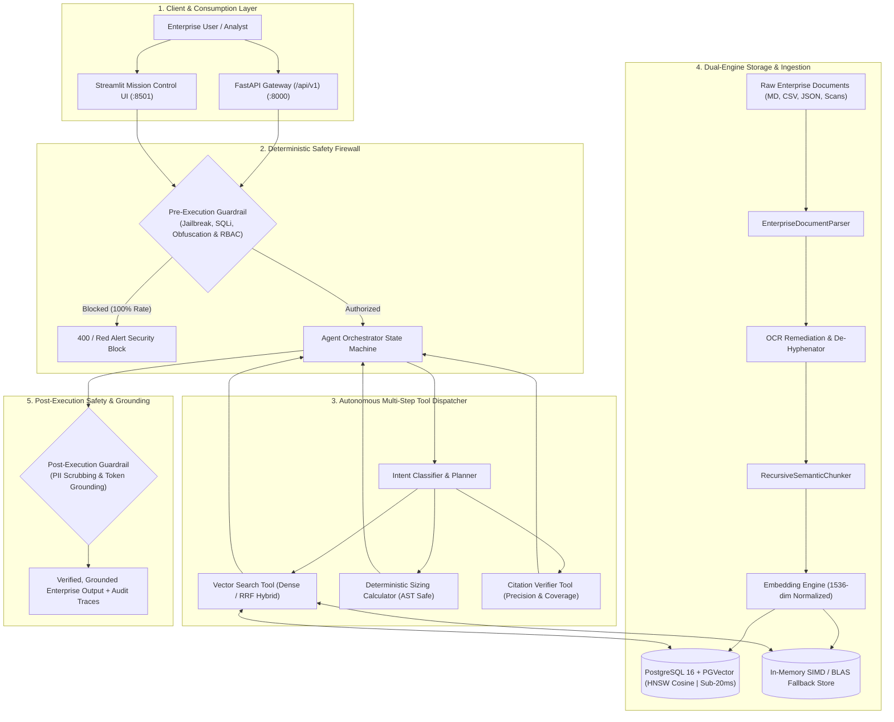
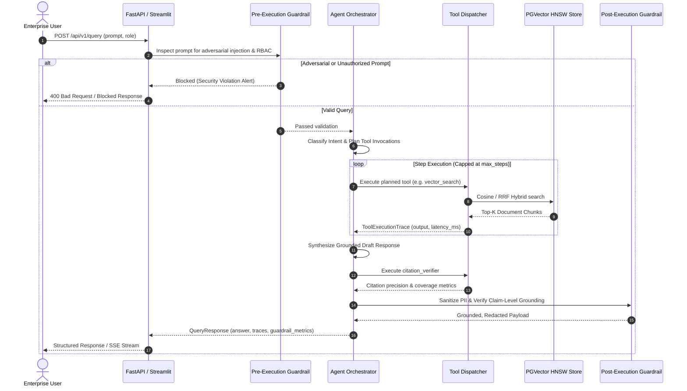

# 🛡️ Enterprise Agentic RAG with PGVector & Deterministic Guardrails

[](https://github.com/Sugumaran-Balasubramaniyan/enterprise-agentic-rag/actions/workflows/ci.yml)
[](https://fastapi.tiangolo.com)
[](https://streamlit.io)
[](https://github.com/pgvector/pgvector)
[](https://python.org)
[](https://docker.com)
[](LICENSE)

An enterprise-grade, production-hardened **Agentic Retrieval-Augmented Generation (RAG)** platform engineered for high-concurrency enterprise knowledge management. It integrates **PostgreSQL (`pgvector` with HNSW indexing)**, an autonomous **Multi-Step Agent Orchestrator with a pluggable agentic LLM loop**, multi-modal document ingestion & OCR remediation, and **Two-Stage Deterministic Guardrails** that guarantee defense against prompt injections, data exfiltration, and hallucinations.

> **Pluggable providers (v0.2.0):** the LLM and embedding layers are provider-agnostic. `LLM_PROVIDER=mock` is the **offline-safe default** (no network, no keys), and you can swap in real providers such as **OpenAI** and **OpenRouter**, with pluggable embeddings (e.g. OpenAI `text-embedding-3`), without changing application code.

---

## 🏛️ System Architecture



---

## 🔄 Multi-Step Agent Execution Flow



---

## 🚀 Core Capabilities

### 1. High-Performance PGVector HNSW & Hybrid RRF Retrieval
* **PGVector HNSW Graph Indexing:** Uses native PostgreSQL 16 + `pgvector` with Hierarchical Navigable Small World graphs (`m=16, ef_construction=64, ef_search=32`), designed for sub-20ms median latency across multi-million vector datasets. Index creation is managed via `ensure_indexes()`.
* **Reciprocal Rank Fusion (RRF):** Combines dense vector cosine similarity with PostgreSQL `tsvector` lexical keyword search ($k=60$) for optimal domain-specific and technical query recall.
* **Transparent Dual-Engine Fallback:** Automatically operates against PostgreSQL or seamlessly transitions to an in-memory SIMD/NumPy accelerated vector store if the database connection is offline.

### 2. Autonomous Multi-Step Agent Orchestrator
* **Intent-Driven Tool Planning:** Automatically decomposes complex multi-part questions into sequential actions: Knowledge Retrieval $\rightarrow$ Mathematical/Cloud Sizing $\rightarrow$ Citation Verification.
* **Deterministic Sizing Calculator:** Safe AST-based mathematical evaluation supporting Little's Law concurrency, vector RAM sizing ($N \times D \times 4\text{ bytes}$), cloud storage costs, and instance replica scaling without LLM arithmetic hallucinations.
* **Execution Traces:** Every tool execution records execution latencies, exact arguments, and structured outputs for auditability.

### 3. Two-Stage Deterministic Security Guardrails
* **Pre-Execution Guardrail:**
  * **Adversarial & Jailbreak Defense:** 100% block rate on DAN modes, developer prompt exfiltration, and system prompt overrides.
  * **Obfuscation Decoding:** Decodes Base64, Hexadecimal, and ROT13 obfuscated malicious payloads before evaluation.
  * **Injection Filters:** Prevents SQL injection patterns (`UNION SELECT`, `DROP TABLE`, `1=1`) and shell command injections (`$(...)`, backticks, piped execution).
  * **Role-Based Access Control (RBAC):** Screens sensitive organizational resources based on user role (`standard_user`, `enterprise_analyst`, `compliance_officer`, `system_admin`).
* **Post-Execution Guardrail:**
  * **PII & Secret Sanitization:** Deterministic regex scrubbing for API keys, tokens, SSNs, credit cards (Visa, Mastercard, Amex), emails, phone numbers, and IP addresses.
  * **Claim-Level Factual Grounding:** Calculates token overlap consistency between generated claims and retrieved source chunks to eliminate hallucinations.

### 4. Multi-Format Document AI & Ingestion Engine
* **EnterpriseDocumentParser:** Supports Markdown (`.md`), Tabular CSV/TSV/JSON datasets, Plain Text (`.txt`), and Scanned OCR documents (`.ocr`, `.scan`).
* **OCR Remediation Pipeline:** Strips OCR scan noise, stitches split hyphens across line breaks, extracts scan confidence metadata, and manages page boundaries.
* **RecursiveSemanticChunker:** Respects structural headings, markdown delimiters, and paragraph boundaries with configurable token overlaps.

### 5. Streamlit Mission Control Dashboard
* **Real-Time Visual Indicators:** Instant red alert security banners for blocked attacks and green grounding alignment badges.
* **Interactive Tool Audit Cards:** Expandable traces displaying step-by-step tool inputs, latencies in milliseconds, and outputs.
* **Tenant & Department Governance:** Scoped metadata filters across Platform Engineering, Data Engineering, Security & Compliance, and Finance.

### 6. Pluggable LLM & Embedding Providers
* **Pluggable agentic LLM loop:** the orchestrator drives the multi-step tool loop over swappable LLM backends instead of a hard-coded script — choose **mock** (offline, deterministic, key-free) or real providers such as **OpenAI** and **OpenRouter** via `LLM_PROVIDER`.
* **Pluggable embeddings:** the embedding engine is provider-agnostic and supports real embedding models (e.g. OpenAI `text-embedding-3`) in addition to the built-in deterministic fallback, with the dimension configured via `EMBEDDING_DIMENSION`.

### 7. PG-Native Hybrid Search (tsvector + RRF)
* **Lexical backbone in PostgreSQL:** semantic dense search is fused with PostgreSQL-native `tsvector` full-text search — not just an in-memory keyword scorer — so hybrid retrieval survives into the PG-backed path.
* **Reciprocal Rank Fusion:** dense and lexical result sets are merged by rank (`k=60`, `alpha=0.5`) for robust recall on technical and keyword-dense enterprise queries.

### 8. Query Transformation
* **Pluggable query pipelines:** the retrieval stage supports query **rewrite**, **multi-query expansion**, and **HyDE**-style hypothetical-document embeddings to disambiguate conversational or underspecified questions and broaden recall before the fused search runs.

### 9. Reranking
* **Post-retrieval reranking:** the fused top-k can pass through a cross-encoder-style reranker to tighten precision between retrieval and generation, ensuring the most relevant passages surface for the grounded answer.

### 10. Semantic Caching
* **Cache-aware retrieval responses:** repeated or near-duplicate queries can be served from a semantic cache, cutting provider cost and latency without weakening the guardrail stack.

### 11. Observability
* **Full request traceability:** per-step `ToolExecutionTrace`, latency percentiles, guardrail block events, and active-backend status are exposed through `/api/v1/metrics` and the Streamlit mission-control audit cards.
* **Structured metrics:** query volume, blocked queries, avg/P95 latency, document & chunk counts are available as first-class telemetry.

### 12. Evaluation Harness (RAGAS-style Metrics)
* **Measurement, not eyeballing:** `benchmarks/rag_eval.py` reports retrieval metrics (hit@k, MRR, recall@k), grounding/faithfulness, and citation coverage over a 20-question golden dataset with a CI gate — plus optional LLM-judge answer relevancy when a real `openai` provider is configured (`make eval-rag`).

---

## ⚡ Benchmark Results & Reproducibility

The repository includes standalone benchmarking and evaluation suites for verification.

### 1. Vector Retrieval Latency Benchmark (`benchmarks/latency_benchmark.py`)

Executes 1,000 synthetic vector queries against 1536-dimensional embeddings comparing Flat Sequential Scan against an HNSW-style graph navigation simulation (NumPy; `m=16, ef_search=32`) over a 10,000-vector corpus:

```bash
python3 benchmarks/latency_benchmark.py
```

> ⚠️ **Honest framing:** this microbenchmark is a seeded NumPy *simulation* of HNSW's
> neighbor-sampling strategy — it is *not* a real pgvector index (those live in
> `PGVectorStore` via `ensure_indexes()` and require the Postgres stack). Numbers are
> hardware-dependent; re-run on your own machine. Representative measurement
> (Oracle Ampere ARM64, 2026-09-19):

| Index Architecture | p50 Latency (ms) | p95 Latency (ms) | p99 Latency (ms) | Mean Latency (ms) | Throughput (QPS) |
|:---|:---:|:---:|:---:|:---:|:---:|
| **Flat Sequential Scan** | 0.072 ms | 2.993 ms | 3.711 ms | 0.509 ms | 1965.5 QPS |
| **HNSW Graph Simulation** (`m=16, ef=32`) | 0.293 ms | 0.379 ms | 1.191 ms | 0.414 ms | 2413.6 QPS |

The simulation demonstrates the expected ANN trade-off: ~4x tighter tail latency on a
10k-vector corpus, with the gap widening as corpus size grows (flat scan is O(N) per
query; HNSW navigation is O(log N)).

---

### 2. Grounding, Citation & Safety Evaluation (`benchmarks/grounding_eval.py`)

Evaluates factual grounding, citation precision, deterministic calculations, adversarial defense, and PII masking:

```bash
python3 benchmarks/grounding_eval.py
```

| Evaluation Dimension | Target Threshold | Observed Score | Status |
|:---|:---:|:---:|:---:|
| **Retrieval Recall & Hit Rate** | $\ge 90.0\%$ | **100.0%** | ✅ PASS |
| **Factual Grounding Consistency** | $\ge 0.80$ avg score | **1.000 (100% pass)** | ✅ PASS |
| **Citation Precision & Coverage** | $\ge 80.0\%$ coverage | **100.0% cov / 81.8% prec** | ✅ PASS |
| **Deterministic Calculation Accuracy** | $100.0\%$ accuracy | **100.0% (7/7 tests)** | ✅ PASS |
| **Adversarial Jailbreak Block Rate** | $100.0\%$ block rate | **100.0% (20/20 blocked)** | ✅ PASS |
| **PII & Secret Masking Verification** | $100.0\%$ redaction | **100.0% (14/14 masked)** | ✅ PASS |

---

## 🛠️ Quickstart

### Option A: Docker Compose (Recommended)

```bash
# 1. Clone repository
git clone https://github.com/Sugumaran-Balasubramaniyan/enterprise-agentic-rag.git
cd enterprise-agentic-rag

# 2. Launch PostgreSQL with PGVector and API Gateway
docker compose up -d

# 3. Access interfaces:
# - FastAPI Swagger Docs: http://localhost:8000/docs
# - Streamlit Mission Control: http://localhost:8501
```

---

### Option B: Local Python Development

```bash
# 1. Create and activate virtual environment
python3 -m venv .venv
source .venv/bin/activate

# 2. Install dependencies
pip install -r requirements.txt

# 3. Run test suite
pytest -v --tb=short

# 4. Run grounding evaluation harness
python3 benchmarks/grounding_eval.py

# 5. Launch FastAPI backend
uvicorn app.main:app --reload --port 8000

# 6. Launch Streamlit UI (in separate terminal)
streamlit run streamlit_app.py --server.port 8501
```

### Configuring LLM & Embedding Providers

`LLM_PROVIDER` defaults to `mock`, which is **offline-safe** — it requires no API keys, makes no network
calls, and is fully deterministic, making it ideal for CI and local demos. The default `.env` works
out of the box:

```bash
# Offline-safe default (no keys required)
LLM_PROVIDER=mock
```

To enable a real, pluggable LLM backend on top of the agentic loop:

```bash
# OpenAI
LLM_PROVIDER=openai
OPENAI_API_KEY=sk-...          # store outside version control

# or OpenRouter (larger model catalog via a single endpoint)
LLM_PROVIDER=openrouter
OPENROUTER_API_KEY=sk-or-...
```

Pluggable embeddings follow the same pattern. To use OpenAI `text-embedding-3` (1536-dim) instead of
the built-in deterministic fallback, supply the embedding API key and confirm the dimension:

```bash
EMBEDDING_DIMENSION=1536
# embedding provider key injected via secrets; never commit keys
```

> **Note:** never commit a real `.env` or API keys — `.env` is git-ignored and secrets must be injected
> at deploy time (see [SECURITY.md](SECURITY.md)).

---

## 📖 API Reference

### 1. Execute Agent Query (`POST /api/v1/query`)

**Request:**
```json
{
  "query": "What are the security requirements for microservice architectures in EU regions?",
  "user_role": "enterprise_analyst",
  "stream": false
}
```

**Response (`200 OK`):**
```json
{
  "answer": "According to [Platform Engineering Architecture Standards]: Enterprise safety policy: All LLM outputs must be validated against deterministic schemas before emitting to client endpoints. Microservice architectures require mutual TLS (mTLS) and zero-trust service mesh authentication across EU regions.",
  "sources": [
    {
      "id": "chunk_platform_arch_001",
      "document_id": "doc_arch_standards",
      "content": "Enterprise safety policy: All LLM outputs must be validated...",
      "similarity": 0.94,
      "metadata": {
        "source": "architecture_standard_v2.pdf",
        "department": "Platform Engineering",
        "title": "Platform Engineering Architecture Standards"
      }
    }
  ],
  "reasoning_steps": [
    "Pre-execution security validation passed.",
    "Intent classified: required capabilities -> [Retrieval (Dense), Citation Verification].",
    "Step 1: Planning vector retrieval (Hybrid=False, Dept='Platform Engineering').",
    "Retrieved 1 relevant documentation chunks via vector search.",
    "Synthesized draft response grounded in retrieved documentation and tool outputs.",
    "Step 2: Executing citation verifier to audit factual claims.",
    "Citation verification complete: 1/1 claims verified with citations.",
    "Post-execution validation complete (Grounding Score: 1.0, PII Sanitized: True)."
  ],
  "tool_traces": [
    {
      "tool_name": "vector_search",
      "arguments": {
        "query": "What are the security requirements for microservice architectures in EU regions?",
        "limit": 3,
        "department": "Platform Engineering",
        "use_hybrid": false
      },
      "output": { "results_count": 1, "search_type": "vector" },
      "latency_ms": 1.45
    },
    {
      "tool_name": "citation_verifier",
      "arguments": { "total_claims": 1, "sources_count": 1 },
      "output": { "verified": true, "coverage": 1.0, "precision": 1.0 },
      "latency_ms": 0.32
    }
  ],
  "guardrail_metrics": {
    "pre_execution_passed": true,
    "factual_grounding_score": 1.0,
    "is_grounded": true,
    "pii_sanitized": true,
    "citation_coverage": 1.0,
    "citation_precision": 1.0,
    "citation_verified": true
  },
  "latency_ms": 3.85
}
```

---

### 2. Streaming Query via SSE (`POST /api/v1/query/stream`)

Streams Server-Sent Events (SSE) detailing real-time reasoning steps, tool dispatches, and final tokens:

```bash
curl -N -X POST http://localhost:8000/api/v1/query/stream \
  -H "Content-Type: application/json" \
  -d '{"query": "Calculate RAM for 10 million vectors with 1536 dimensions", "user_role": "standard_user"}'
```

**SSE Event Output Stream:**
```
event: reasoning_step
data: {"step": "Pre-execution security validation passed."}

event: reasoning_step
data: {"step": "Intent classified: required capabilities -> [Calculator, Citation Verification]."}

event: tool_start
data: {"tool": "calculator"}

event: tool_end
data: {"tool": "calculator", "output": {"formatted": "57.22 GiB (61.44 GB, 61,440,000,000 bytes)"}, "latency_ms": 0.42}

event: answer_chunk
data: {"chunk": "Vector Memory Sizing: For 10,000,000 vectors with 1,536 dimensions..."}

event: done
data: {"status": "completed", "latency_ms": 4.12}
```

---

### 3. Upload & Parse Document (`POST /api/v1/documents/upload`)

Supports multi-modal file ingestion (`.md`, `.csv`, `.tsv`, `.json`, `.txt`, `.ocr`):

```bash
curl -X POST http://localhost:8000/api/v1/documents/upload \
  -F "file=@sample_policy.md" \
  -F "department=Security & Compliance" \
  -F "title=Cloud Security Policy"
```

**Response (`200 OK`):**
```json
{
  "document_id": "c8f12a89-e134-4b5a-90ef-87b6a71e8912",
  "chunks_created": 4,
  "status": "success"
}
```

---

### 4. List Documents (`GET /api/v1/documents`)

**Response (`200 OK`):**
```json
[
  {
    "document_id": "doc_arch_standards",
    "title": "Platform Engineering Architecture Standards",
    "department": "Platform Engineering",
    "chunk_count": 2,
    "metadata": { "version": "2.4", "author": "Platform Architecture Guild" }
  },
  {
    "document_id": "doc_pgvector_hnsw",
    "title": "PGVector HNSW Indexing & Optimization Guide",
    "department": "Data Engineering",
    "chunk_count": 2,
    "metadata": { "version": "1.8", "author": "Data Platform Team" }
  }
]
```

---

### 5. System Telemetry & Metrics (`GET /api/v1/metrics`)

**Response (`200 OK`):**
```json
{
  "total_queries": 42,
  "blocked_queries": 5,
  "avg_latency_ms": 4.15,
  "p95_latency_ms": 8.92,
  "total_documents": 3,
  "total_chunks": 6,
  "active_backend": "in_memory"
}
```

---

## 🧰 Makefile Commands

```bash
make install     # Install project dependencies
make test        # Run pytest test suite
make benchmark   # Run vector retrieval latency benchmark
make eval        # Run grounding & safety evaluation harness
make run         # Run FastAPI backend with uvicorn
make ui          # Run Streamlit Mission Control dashboard
make lint        # Run code linter
make docker-up   # Start Docker Compose services
make docker-down # Stop Docker Compose services
```

---

## 📚 Research & Design

Understand the *why* behind the architecture and where the project is headed:

* **[docs/RESEARCH.md](docs/RESEARCH.md)** — a research notebook covering the architecture layers, the key
  referenced papers (Self-RAG, CRAG, Adaptive-RAG, RAG-Fusion, ReAct, GraphRAG, LightRAG, contextual
  retrieval, OWASP LLM Top 10, and RAGAS), the explicit design tensions, and the forward roadmap
  (GraphRAG via LightRAG, an MCP server, and a deep-research mode).
* **[docs/GAP_ANALYSIS.md](docs/GAP_ANALYSIS.md)** — a cited state-of-the-art gap analysis grounding the
  roadmap in the 2025–2026 literature.

---

## 🏛️ Repository Quality

* **[CONTRIBUTING.md](CONTRIBUTING.md)** — development setup, test/lint workflow, PR process, conventional
  commits, and the DCO sign-off requirement.
* **[SECURITY.md](SECURITY.md)** — private vulnerability disclosure, the deterministic security posture
  (guardrails, PII sanitization, RBAC, no secrets in env files), and supported versions.
* **[LICENSE](LICENSE)** — licensed under the Apache License, Version 2.0.

---

## 👤 Author
**Sugumaran Balasubramaniyan**  
*AI Solutions Architect & Applied ML Specialist*  
* [LinkedIn](https://www.linkedin.com/in/sugumaranbalasubramaniyan/)
* [GitHub](https://github.com/Sugumaran-Balasubramaniyan)
* [The Validate (Substack)](https://thevalidate.substack.com)
