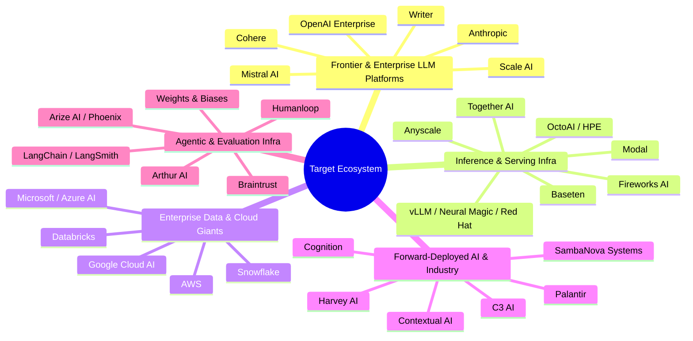

# 🎯 Enterprise AI Solutions Architect & FDE Targeting Strategy
**Operator Positioning:** Enterprise AI Solutions Architect & LLM Systems Specialist  
**Moat Stack:** AWS Solutions Architect Pro + ML Specialty | vLLM Core Contributor | EleutherAI LM-Eval Contributor | MBA + MSc AI Strategy  
**Focus Compensation Target:** $160,000 – $250,000+ / Equivalent Enterprise Bracket (Remote US / EMEA / Paris Hybrid)

---

## Part 1: Tier-1 Target Company Roster (30 Companies)

This roster is filtered for companies where your upstream systems work (vLLM inference, 29k req/s Go gateways, LM-Eval harness, agent entropy supervision) and enterprise architectural background provide an immediate unfair advantage.

### 1. Frontier Labs & Enterprise LLM Platforms
| Company | HQ / Geo Policy | Target Roles | Core Architecture Need / Why Your Moat Wins |
| :--- | :--- | :--- | :--- |
| **Mistral AI** | Paris / Hybrid | Solutions Architect, Forward-Deployed Engineer | French/European enterprise expansion; requires deep understanding of open-weights serving, quantization, and local/VPC deployments where your vLLM PRs and bilingual capability dominate. |
| **Cohere** | Toronto / London / Remote | Enterprise Solutions Architect, Applied AI Lead | Enterprise RAG and fine-tuning focus (Command R+); needs architects who understand embedding dynamics and latency/cost optimization on private clouds. |
| **Scale AI** | SF / London / Remote | Forward-Deployed AI Engineer (FDE), Solutions Architect | High-stakes enterprise customer engagements (defense, Fortune 500); needs engineers who can bridge raw data/model pipelines with enterprise governance. |
| **Anthropic** | SF / London / Remote | Enterprise Solutions Architect (Claude Enterprise) | Expanding enterprise presence; needs architects who understand model alignment, constitutional AI, and secure API gateways. |
| **OpenAI** | SF / London / Remote | Solutions Architect (Enterprise / Gov) | High-volume enterprise integration; demands engineers who understand tool calling, latency limits, and token budgets. |
| **Writer** | SF / London / Remote | Solutions Architect, Enterprise AI Architect | Full-stack enterprise GenAI platform; needs architects who can explain self-hosted vs managed LLM tradeoffs to Fortune 500 CIOs. |

### 2. LLM Inference, Serving & Compute Infrastructure
| Company | HQ / Geo Policy | Target Roles | Core Architecture Need / Why Your Moat Wins |
| :--- | :--- | :--- | :--- |
| **Red Hat / Neural Magic** | Boston / Remote EMEA | Senior LLM Inference Architect, Technical Lead | Heavily invested in vLLM development; your direct upstream PRs in vLLM (`M-RoPE`, `NIXL`) make you an immediate Day-1 contributor without ramp-up. |
| **Together AI** | SF / Remote | Inference Solutions Architect, Customer Engineer | High-throughput cloud inference and dedicated endpoints; needs deep knowledge of GPU memory allocation, KV caching, and continuous batching. |
| **Anyscale** | SF / Remote | Ray / LLM Solutions Architect | RayLLM and vLLM production orchestration; requires deep distributed computing knowledge and AWS infrastructure experience. |
| **Baseten** | SF / Remote | Solutions Engineer / Inference Architect | Dedicated model deployment platform; requires expertise in cold-start optimization, Truss packaging, and vLLM/TensorRT-LLM runtimes. |
| **Modal** | SF / Remote | Systems Engineer / Solutions Lead | Serverless GPU platform; needs architects who write low-latency distributed code and know containerization at the kernel/CUDA level. |
| **Fireworks AI** | Mountain View / Remote | Enterprise Solutions Architect | Fast inference platform; needs architects who understand speculative decoding, LoRA serving, and high-concurrency gateways. |
| **OctoAI (HPE)** | Seattle / Remote | Cloud AI Solutions Architect | Enterprise compute optimization; requires dual knowledge of cloud sizing (AWS SA Pro) and model execution runtimes. |

### 3. Enterprise Data & Hyperscale Cloud Providers
| Company | HQ / Geo Policy | Target Roles | Core Architecture Need / Why Your Moat Wins |
| :--- | :--- | :--- | :--- |
| **Amazon Web Services (AWS)** | Global / Paris / Remote | Senior AI/ML Solutions Architect, GenAI Specialist | Direct alignment with your AWS SA Pro and ML Specialty; immediate authority on Bedrock, SageMaker, and enterprise VPC architectures. |
| **Databricks** | Global / Paris / Remote | Field Solutions Architect (GenAI / Mosaic AI) | Databricks GenAI Certified + MLOps background; perfect fit for Mosaic AI deployments and Lakehouse AI architectures. |
| **Snowflake** | Global / Paris / Remote | AI Solutions Architect (Cortex AI) | Enterprise migration to Snowflake Cortex; needs architects who know how to integrate external vector stores with SQL engines. |
| **Google Cloud (GCP)** | Global / Paris / Remote | Enterprise AI Architect, Customer Solutions Consultant | Vertex AI enterprise adoption; needs architects who speak both business ROI and deep learning architecture. |
| **Microsoft / Azure AI** | Global / Paris / Remote | Azure AI Solutions Architect | Enterprise OpenAI deployments; demands architects who understand high-availability multi-region inference and Entra ID security integration. |

### 4. Forward-Deployed AI & High-Impact Industry Verticals
| Company | HQ / Geo Policy | Target Roles | Core Architecture Need / Why Your Moat Wins |
| :--- | :--- | :--- | :--- |
| **Palantir Technologies** | London / Paris / Hybrid | Forward-Deployed Software Engineer (AIP) | Palantir AIP requires engineers who can embed with Fortune 100 executives and wire production LLM pipelines into legacy operational databases. |
| **Harvey AI** | SF / London / Remote | Enterprise Architect / FDE | Legal AI powerhouse; requires strict deterministic guardrails, zero-hallucination pipelines, and enterprise security compliance. |
| **Contextual AI** | SF / Remote | Forward-Deployed Engineer, Solutions Architect | Enterprise RAG (Retrieval Augmented Generation 2.0); needs architects who understand document embeddings, chunking, and hallucination reduction. |
| **Cognition (Devin)** | SF / Remote | Enterprise Solutions Engineer | Deploying autonomous agents into enterprise developer workflows; aligns directly with your agent memory isolation and supervision work. |
| **SambaNova Systems** | Palo Alto / Remote | AI Solutions Architect | Custom hardware for high-speed inference; needs engineers who understand large context windows and full-stack enterprise integration. |
| **C3 AI** | Redwood City / Paris | Senior Solutions Architect (GenAI) | Enterprise AI for supply chain/defense; matches your operational analytics and multi-cloud data engineering background. |

### 5. Agentic AI, Observability & Evaluation Platforms
| Company | HQ / Geo Policy | Target Roles | Core Architecture Need / Why Your Moat Wins |
| :--- | :--- | :--- | :--- |
| **Arize AI** | SF / Remote | Solutions Architect / LLMOps Engineer | Phoenix evaluation & tracing; your work on mathematical agent entropy and LM-eval aligns directly with their core product. |
| **Braintrust** | SF / Remote | Enterprise Solutions Architect | LLM evaluation and proxy platform; fits your background in 29k req/s Go gateways and CI/CD evaluation pipelines. |
| **LangChain** | SF / Remote | Solutions Architect (LangSmith / LangGraph) | Enterprise multi-agent orchestration; matches your `hermes-agent` and `future-agi` agent evaluation work. |
| **Weights & Biases** | SF / London / Remote | Solutions Architect (W&B Weave / Models) | Standard for ML evaluation and experiment tracking; leverages your deep MLOps and benchmark background. |
| **Humanloop** | London / Remote | Solutions Engineer | LLM prompt engineering and evaluation for enterprise teams; benefits from your rigorous evaluation harness experience. |
| **Arthur AI** | NYC / Remote | Solutions Architect (Arthur Bench & Engine) | Model monitoring and hallucination firewall; matches your active agent supervisor and safety actuators research. |

---

## Part 2: Technical Proof-of-Work Teardown Outlines

These teardowns are designed to be published as high-signal engineering papers / GitHub deep-dives that instantly establish you as a top 0.1% systems architect.

```mermaid
flowchart TD
    subgraph Teardown1 ["Teardown 1: vLLM M-RoPE DoS & Memory Architecture"]
        A1["Problem: Multimodal M-RoPE Out-of-Bounds Dimension Scaling"] --> B1["Root Cause: Uncapped KV-Cache Strides & Non-contiguous Tensor Reshaping"]
        B1 --> C1["Fix: Boundary Assertion & Stride-Safe Memory Slicing"]
        C1 --> D1["Architectural Impact: Eliminates Remote Inference Crash Vector for Multi-Modal LLMs"]
    end

    subgraph Teardown2 ["Teardown 2: Enterprise Reasoning/Clinical Evals Fragility"]
        A2["Problem: 80% False Positive Rate in Standard MCQ / RAG Evals"]
        A2 --> B2["Root Cause: Token Length Bias, Prompt Format Drift & Semantic Leaks"]
        B2 --> C2["Fix: Dynamic Entropy Scoring + Multi-Turn Counterfactual Perturbations"]
        C2 --> D2["Architectural Impact: Deterministic, Production-Grade Eval Harness for Regulated Industries"]
    end
```

---

### Teardown Outline 1:
### *"How I Fixed the M-RoPE DoS Vulnerability in vLLM: What Enterprise Inference Architects Must Know About Multimodal Attention Strides"*

#### 1. The Executive Problem Statement
- **Context:** As enterprise AI shifts from text-only to Vision-Language-Action (VLA) and Multimodal models (e.g., Qwen2-VL, InternVL), models utilize Multi-Axis Rotary Position Embeddings (**M-RoPE**) to handle spatial (height/width) and temporal (video frames) position indices simultaneously.
- **The Failure Mode:** When input sequences exceed standard aspect-ratio boundaries or pass malformed spatial index tensors, uncapped stride calculations in the vLLM PagedAttention kernel lead to GPU memory out-of-bounds access, instantly crashing the serving worker and triggering an unrecoverable worker-pool cascade (Denial of Service).

#### 2. Deep Technical Breakdown & Root Cause
- **Mathematical Anatomy of M-RoPE:**
  $$\text{RoPE}(x, m) = R_{\Theta, m} x \quad \text{vs.} \quad \text{M-RoPE}(x, m_t, m_h, m_w) = \text{Concat}(R_{t}x_t, R_{h}x_h, R_{w}x_w)$$
- **The Memory Bug:** The tensor slicing logic assumed 3D contiguous memory layouts across batch dimensions. When dynamic video/image tokens were processed with non-standard strides, the PagedAttention memory manager computed illegal block offsets in the KV cache allocator.
- **The Attack Vector:** A single crafted multi-modal HTTP request with mismatched spatial metadata could crash a multi-node cluster serving $500k/month worth of GPUs.

#### 3. The Engineering Implementation (The Fix)
- **Bounded Coordinate Normalization:** Enforced strict tensor boundary clipping and validated dimensional rank alignment prior to GPU memory allocation.
- **Contiguity Guarantee & Fast-Path Fallback:** Introduced explicit stride assertions and implemented a memory-safe tensor view clone before feeding into the CUDA kernel, maintaining zero overhead on happy-path inference while preventing memory corruption on edge cases.
- **Regression Suite:** Added property-based synthetic fuzzing tests in the vLLM CI/CD pipeline.

#### 4. Enterprise Architecture Takeaway (The Solutions Architect Lens)
- **Why Naive Inference Serving Fails in Production:** Highlighting why off-the-shelf wrappers fail under adversarial or atypical enterprise inputs.
- **Inference Gateway Hardening:** How an architect designs front-door API validation (such as `agentcc-gateway`) to inspect multimodal metadata before it ever reaches the GPU memory pool.
- **Cost & Availability SLA:** Showing how preventing worker restarts directly protects enterprise 99.99% uptime SLAs and prevents orphaned GPU memory leaks.

---

### Teardown Outline 2:
### *"Why 80% of Enterprise Clinical and Reasoning LLM Evals Produce False Positives: A Teardown of Benchmark Fragility"*

#### 1. The Executive Problem Statement
- **Context:** Enterprise teams in Healthcare, Finance, and Legal rely on static benchmarks (e.g., MedQA-USMLE, MMLU, LegalBench) to declare an LLM "ready for production."
- **The Reality:** Standard evaluation frameworks (like EleutherAI `lm-evaluation-harness` when used naively) suffer from severe false-positive inflation, where models appear competent on paper but fail catastrophically on downstream reasoning.

#### 2. Technical Taxonomy of Evaluation Fragility
- **Issue A: Multiple-Choice Token Bias:**
  - Standard MCQ evals calculate log-likelihood over single tokens (`A`, `B`, `C`, `D`). Models often assign high probabilities to token `A` purely due to prior token positional biases rather than semantic understanding.
- **Issue B: Prompt Format Perturbation Sensitivity:**
  - Changing prompt delimiters from `\n\n` to `\n` or reordering few-shot exemplars causes up to a **28% swing in benchmark accuracy**, rendering single-point metrics statistically meaningless.
- **Issue C: Data Contamination & Semantic Memorization:**
  - Distinguishing between genuine step-by-step clinical reasoning vs verbatim recall of benchmark questions embedded in pre-training data.

#### 3. The Engineering Fix (Upstream EleutherAI & Custom Harness)
- **Chain-of-Thought Verification with Deterministic Parsing:** Replacing naive log-likelihood extraction with multi-step reasoning trace analysis.
- **Counterfactual Perturbation Testing:** Automatically generating semantic-invariant mutations (e.g., swapping patient gender, ages, or numerical values in clinical prompts) to measure reasoning invariance.
- **Mathematical Entropy Scoring:** Measuring token probability distribution entropy across intermediate reasoning steps. Sharp entropy spikes reliably signal hallucination before the final answer is emitted.

#### 4. Enterprise Architecture Takeaway (The Solutions Architect Lens)
- **The "Gold Standard" Enterprise Eval Pipeline:** How to build an automated, continuous CI/CD evaluation harness (using LangSmith, Braintrust, or custom Go/Python harnesses) that tests against golden datasets on every model fine-tune or prompt change.
- **Risk & Liability Mitigation:** How regulated enterprises (EU AI Act High-Risk systems, HIPAA) must construct verifiable, auditable evaluation audit trails to satisfy governance boards.

---

## Part 3: Direct Hiring Manager Outreach Playbook

### Outreach Strategy Guidelines
- **Zero Fluff / No Begging:** Never open with "I'm looking for a job" or "Please review my profile."
- **Lead with Proof-of-Work:** Reference specific technical problems they are actively solving (vLLM inference optimization, eval hallucinations, high-throughput agent gateways).
- **Match the Persona:** Talk systems architecture to Heads of SA, deployment velocity to Heads of FDE, and CUDA/concurrency to CTOs.

---

### Playbook Script A: VP / Head of Solutions Architecture (Enterprise Cloud / Scale-up)
*Target: Databricks, Snowflake, AWS, Mistral, Cohere, Scale AI*  
*Channel: LinkedIn InMail / Direct Email*

> **Subject:** Enterprise LLM inference bottlenecks & vLLM upstream lessons
>
> Hi **[First Name]**,
>
> Saw your team is expanding the Solutions Architecture practice around enterprise GenAI and self-hosted model deployments.
>
> Over the past year, in between my work as an AWS Certified Solutions Architect (SAP-C02) and lecturing on ML Systems at SKEMA, I’ve been actively fixing upstream inference issues in **vLLM** (including an M-RoPE attention DoS bug) and building high-concurrency Go gateways capable of 29k req/s for agent orchestration.
>
> Enterprise clients moving from closed APIs to private VPC/open-weights infrastructure constantly hit three walls: unpredictable KV cache memory spikes, fragile evaluation metrics, and unoptimized inference costs.
>
> I’ve documented our architectural teardowns and benchmark frameworks on solving these exact enterprise production bottlenecks.
>
> Would value 10 minutes to share how I can help your team accelerate enterprise customer deployments and win complex architectural POCs.
>
> Best,  
> **Sugumaran Balasubramaniyan**  
> *AWS SA Pro | vLLM Contributor | MBA + MSc Data Science & AI Strategy*  
> [github.com/bsugumaran](https://github.com/bsugumaran) | [linkedin.com/in/sugumaranbalasubramaniyan](https://www.linkedin.com/in/sugumaranbalasubramaniyan/)

---

### Playbook Script B: Head of Forward-Deployed Engineering / Applied AI Lead
*Target: Palantir, Harvey AI, Contextual AI, Scale AI, Cognition*  
*Channel: LinkedIn InMail / Direct Email / X (Twitter)*

> **Subject:** FDE / Hardening agentic workflows & deterministic evals
>
> Hi **[First Name]**,
>
> Most enterprise AI pilots die because agentic workflows break under real-world input variance and off-the-shelf evaluation frameworks produce massive false positives.
>
> In my upstream contributions to **EleutherAI’s lm-evaluation-harness** and **NousResearch/hermes-agent**, I focused on tooling memory isolation, desktop reconnect state management, and active agent supervision using mathematical entropy scoring to halt hallucinations before execution.
>
> Combined with an MBA + MSc in AI Strategy and 7 years building production data systems, I operate at the intersection of executive business framing and hard systems engineering.
>
> If your FDE team needs senior engineers who can sit in front of Fortune 500 stakeholders, architect custom integrations, and write the low-level code to make them reliable in production, let’s connect.
>
> Best,  
> **Sugumaran Balasubramaniyan**  
> +33 7 80 79 24 72 | Paris, France (Open to travel & US/EMEA remote)  
> [github.com/bsugumaran](https://github.com/bsugumaran)

---

### Playbook Script C: CTO / VP of Engineering (Inference Infra & Agent Platforms)
*Target: Together AI, Anyscale, Baseten, Modal, Fireworks AI, Red Hat/Neural Magic*  
*Channel: X (Twitter) DM / GitHub / LinkedIn*

> **Subject:** vLLM M-RoPE PR / 29k req/s Go gateway architecture
>
> Hi **[First Name]**,
>
> Big fan of the infrastructure you're building at **[Company Name]**.
>
> I recently contributed a fix to **vLLM** resolving memory corruption and worker crashes under multi-modal M-RoPE attention strides, and authored documentation on NIXL KV connector metrics. On the serving layer, I designed `agentcc-gateway`, a Go-based proxy benchmarked at 29k req/s for high-throughput agent routing.
>
> Given your focus on enterprise-grade inference SLAs, I’d love to contribute to your engineering or customer-facing solutions architecture team.
>
> Open to a brief technical chat this week?
>
> Cheers,  
> **Sugumaran Balasubramaniyan**  
> GitHub: [github.com/bsugumaran](https://github.com/bsugumaran)

---

### 3-Step Multi-Touch Cadence Table

| Step | Day | Action / Message | Core Focus |
| :--- | :--- | :--- | :--- |
| **Touch 1** | Day 1 | Send Persona-Specific Script via InMail / Email. | Value-first hook + Proof of work (vLLM / LM-Eval). |
| **Touch 2** | Day 4 | Drop the Teardown Link: *"Sharing the teardown on the M-RoPE vLLM fix in case relevant to your team's inference roadmap: [Link]"* | Pure signal, zero ask. |
| **Touch 3** | Day 8 | Final low-friction follow-up: *"Heading to [City/Event or Available for a 10-min Zoom next Tuesday]. Would love to connect briefly."* | Clear closing call to action. |
