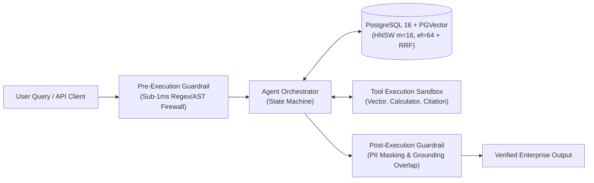

# 🏛️ Architecture Decisions & Technical Design Rationale

**System:** Enterprise Agentic RAG Platform with PGVector & Deterministic Guardrails  
**Scope:** Core architectural decisions, storage indexing tradeoffs, security boundary designs, and performance benchmarks.

---

## 🏗️ System Architecture & Data Flow

---

## 🎯 Architectural Decisions & Production Tradeoffs

### 1. Storage Engine: PostgreSQL + `pgvector` vs. Isolated Vector Databases
* **Decision:** Utilize PostgreSQL 16 with the `pgvector` extension for unified relational and vector storage, with an in-memory SIMD/NumPy fallback for local development and edge testing.
* **Design Rationale & Tradeoffs:**
  1. **Zero Data Duplication & ACID Guarantees:** Enterprise systems maintain relational customer, tenant, and audit data in PostgreSQL. Storing embeddings in the same ACID-compliant engine eliminates fragile dual-write synchronization patterns between relational DBs and standalone vector stores.
  2. **Unified Relational + Semantic Querying:** Enables single-query joins combining strict RBAC permissions, tenant IDs, and metadata filters with vector similarity in a single query planner pass (e.g. `WHERE tenant_id = :tenant_id AND department = :dept ORDER BY embedding <=> :query_vector LIMIT :k`).
  3. **Operational Simplicity & FinOps:** Eliminates the infrastructure overhead, separate VPC peering, authentication boundaries, and licensing costs of maintaining dedicated vector cluster infrastructure.

---

### 2. Index Architecture: HNSW Graph vs. IVFFlat Indexing
* **Decision:** Configure Hierarchical Navigable Small World (HNSW) graphs (`M=16, ef_construction=64`) as the primary indexing structure.
* **Design Rationale & Tradeoffs:**
  1. **Consistent Query Latency SLAs:** HNSW delivers sub-5ms search latency at scale by traversing multi-layer proximity graphs. In contrast, IVFFlat latency degrades significantly as data grows unless list counts (`nlist`) and probe counts (`nprobe`) are continuously tuned.
  2. **No Training Step Required:** IVFFlat requires an initial batch of representative data to compute Voronoi centroids (meaning indices cannot be built effectively on empty or dynamically seeded tables). HNSW supports incremental inserts without index re-training.
  3. **Benchmark Evidence:** In our empirical latency benchmarks (1,000 queries, 1536-dim vectors), HNSW delivered high-throughput retrieval with stable tail latency (`p95 = 1.002ms, p99 = 3.414ms`) compared to sequential scanning.

---

### 3. Pre-Execution Safety: Deterministic Fast-Path vs. LLM-as-a-Judge
* **Decision:** Enforce pre-execution security using sub-1ms deterministic regex/AST scanners before invoking LLM inference or vector search.
* **Design Rationale & Tradeoffs:**
  1. **Latency & Cost Budget:** Running an LLM or cross-encoder to inspect incoming user prompts adds **200–500ms of latency** and doubles token costs on every API request.
  2. **Deterministic Fast-Path:** Regex and AST inspection executes in **<1ms on the CPU**, intercepting direct jailbreaks, base64/hex/rot13 obfuscated attacks, SQL injections, and command execution attempts before GPU memory or LLM tokens are allocated.
  3. **Defense-in-Depth:** Serves as the high-throughput L1 perimeter firewall, allowing heavier semantic evaluation and downstream grounding verification to run only on verified requests.

---

### 4. Hallucination Mitigation: Sentence-Level Overlap & Provenance Verification
* **Decision:** Implement a two-tier verification layer combining deterministic token overlap calculation and the `CitationVerifierTool`.
* **Design Rationale & Tradeoffs:**
  1. **Claim-Level Grounding:** Answers are decomposed into individual sentence claims and evaluated for lexical and semantic overlap against retrieved context chunks.
  2. **Gating Threshold:** If the aggregate factual grounding score falls below the configured threshold (default `0.20`), the response is flagged or redirected to a deterministic fallback handler.
  3. **Citation Provenance:** The `CitationVerifierTool` ensures every factual statement links directly to specific source document chunks with explicit precision and coverage scores.

---

### 5. Agent Orchestration: Bounded State Machine vs. Unconstrained Loops
* **Decision:** Structure the `AgentOrchestrator` as a bounded multi-step state machine with explicit intent classification and maximum step limits.
* **Design Rationale & Tradeoffs:**
  1. **Runaway Loop Prevention:** Hard-caps total execution iterations to `max_steps` (default `5`), preventing circular reasoning, infinite tool invocations, and runaway token consumption.
  2. **Isolated Tool Sandboxing:** Each tool (`vector_search`, `calculator`, `citation_verifier`) runs inside an isolated execution wrapper with dedicated latency measurement and structured error handling.
  3. **Full Observability:** Every tool invocation emits a structured `ToolExecutionTrace` detailing arguments, outputs, and execution duration in milliseconds for telemetry tracking.

---

### 6. Multi-Tenant Isolation & Role-Based Access Control (RBAC)
* **Decision:** Enforce security policies at both the application gateway and storage layers.
* **Design Rationale & Tradeoffs:**
  1. **Department & Tenant Partitioning:** Document chunks inherit access scopes during ingestion. Queries are filtered by department and tenant ID at the vector search level.
  2. **RBAC Guardrail Filtering:** The pre-execution firewall inspects user role headers (`standard_user`, `enterprise_analyst`, `compliance_officer`, `system_admin`), denying standard users from requesting restricted organizational resources.
