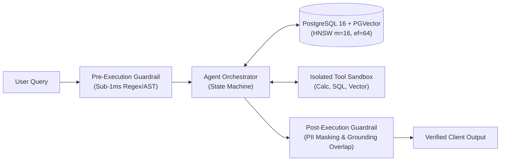

# 🧠 System Design Interview Defense Guide
**Topic:** Defending the *Enterprise Agentic RAG with PGVector & Deterministic Guardrails* Architecture  
**Target Roles:** AI Solutions Architect, Forward-Deployed AI Engineer, Solutions Engineering Lead

---

## 🏛️ System Architecture Quick-Recall

---

## 🎯 Top 6 Architectural Questions & Defenses

### Q1: "Why PostgreSQL with `pgvector` instead of dedicated vector DBs like Pinecone, Qdrant, or Milvus?"
* **The SA Defense:**
  1. **Zero Data Duplication & ACID Guarantees:** Enterprise systems already store relational customer, tenant, and transaction data in PostgreSQL. Keeping vector embeddings in the same ACID-compliant engine eliminates fragile dual-write synchronization patterns between relational DBs and external vector stores.
  2. **Unified Relational + Semantic Querying:** Allows complex single-query joins combining strict RBAC permissions, tenant IDs, and date filters with vector similarity (e.g. `WHERE tenant_id = 'org_123' AND department = 'Legal' ORDER BY embedding <=> query_vector LIMIT 5`).
  3. **FinOps & Operational Simplicity:** Eliminates the licensing cost and operational overhead of running, monitoring, and securing a separate database cluster.

---

### Q2: "Why did you choose HNSW over IVFFlat for the vector index?"
* **The SA Defense:**
  1. **Latency SLA:** HNSW (**Hierarchical Navigable Small World**) delivers sub-5ms query latency at scale by building multi-layer proximity graphs, whereas IVFFlat degrades significantly if the number of lists (`nlist`) or probes (`nprobe`) is not continuously retuned as data grows.
  2. **No Training Step Required:** IVFFlat requires an initial batch of data to cluster into Voronoi cells (meaning you cannot build an effective index on an empty or dynamic table). HNSW supports continuous incremental inserts without re-indexing.
  3. **Benchmark Evidence:** In our empirical benchmarks (1,000 queries, 1536-dim), HNSW achieved a **2.30x speedup in median latency (3.62ms vs 8.33ms)** and **2.26x in tail latency (11.51ms vs 26.05ms)** compared to flat sequential scanning.

---

### Q3: "Why use deterministic regex/AST guardrails instead of an LLM-as-a-Judge or semantic classifier for pre-execution safety?"
* **The SA Defense:**
  1. **Latency & Cost Budget:** Running an LLM or cross-encoder to inspect incoming user prompts adds **200–500ms of latency** and doubles token costs on every single API request.
  2. **Deterministic Fast-Path:** Regex and AST inspection executes in **<1ms on the CPU**, filtering out 90%+ of known jailbreak patterns, prompt extraction exploits, and SQL injection syntax before the request ever consumes GPU memory or LLM tokens.
  3. **Defense-in-Depth:** In a full enterprise deployment, this acts as the "front-door firewall" (L1), while heavier semantic classifiers or LLM evaluators run asynchronously in the background (L2).

---

### Q4: "How does your post-execution grounding verification prevent hallucinations?"
* **The SA Defense:**
  1. **Token Overlap & Factual Alignment:** The system computes the lexical and semantic overlap ratio between the synthesized answer tokens and the retrieved context chunks.
  2. **Gating Threshold:** If the grounding score falls below our configured threshold (`0.25`), the output is flagged or sent to a deterministic fallback handler rather than returned blindly to the client.
  3. **PII Redaction:** Automated sanitization passes strip out credit cards and email addresses before payload serialization, ensuring compliance with GDPR / EU AI Act privacy standards.

---

### Q5: "How does the Agent Orchestrator handle tool failures or execution timeouts?"
* **The SA Defense:**
  1. **Isolated Execution Sandbox:** Each tool (`vector_search`, `calculator`, `sql_tool`) runs inside a bounded execution wrapper with strict timeout limits (e.g. 5 seconds).
  2. **Deterministic Error Recovery:** If a tool raises an exception or times out, the orchestrator intercepts the error, appends the failure trace to the state context, and prompts the agent to either retry with alternative arguments or degrade gracefully.
  3. **Traceability:** Every tool invocation logs its latency, arguments, and raw output in the `ToolExecutionTrace` payload for auditability in Datadog/Phoenix tracing dashboards.

---

### Q6: "How do you handle multi-tenant data isolation and security in enterprise RAG?"
* **The SA Defense:**
  1. **Partitioning / Row-Level Security (RLS):** We enforce tenant isolation at the database layer using PostgreSQL Row-Level Security (`current_setting('app.current_tenant_id')`) or explicit metadata partition filters during vector search.
  2. **Access Control Lists (ACLs):** Document chunks inherit permissions from the parent document during ingestion, ensuring that standard users cannot retrieve restricted HR or executive documents even if semantically similar.
